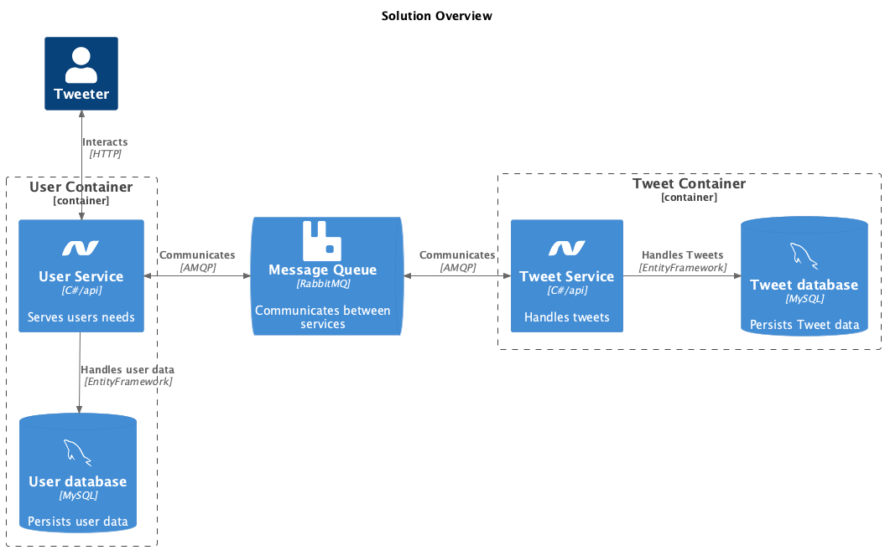

# System Integration Compulsory Assignment 1

## Helicopter view description:

The assignment aims to demonstrate 2 domain specific services, communicating with each other over a RabbitMQ messaging system

## Helpers for reviewing
There are a couple of configuration files for [Bruno](bruno_collection.json) and [Postman](postman_collection.json)

## Service description:
- A [UserService](UserService) implemented as an API with basic CRUD controls for users
- A [TweetService](TweetService) implemented as an API with basic CRUD controls for "Tweets"

## Functionality
The 2 services are not aware of each other, and work very well within their isolated respective code bases. The only obstruction for the Tweeting service to persist a tweet, is that someone wanted to ensure that the user is actually a registered user. Therefore it submits a fire-and-hope request to a RabbitMQ, and waits until it has a confirming response before flushing data to it's database
For every event in both services, a debug messages is logged (Using Serilog with Console and Seq sinks), and can be queried in the Seq instance launched in Docker

## Scaling considerations
The solution is split on the y-axis to begin with. Each of the two domains, Users and Tweets, live in their own logical universe and are happily unaware of their neighbours. 

## Missed opportunities
At the time of writing, a few things are not implemented

- The user validation is not happening at all
- The Tweet model is too simple. Right now the user has to come up with the ID for a tweet, and it still has to be unique
- There is no error handling. Be carefull when testing, because both services will crash hard when doing something I didn't image someone would do to a service