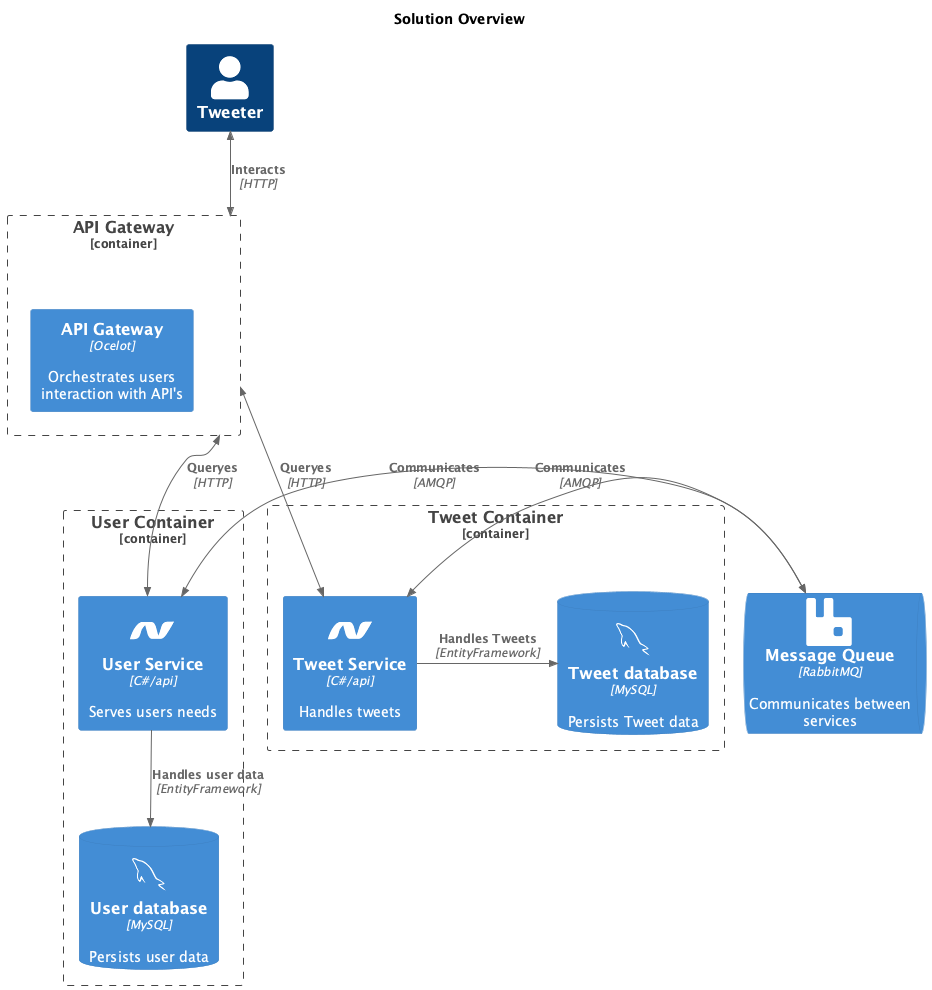

# System Integration Compulsory Assignment 2

## Assigment Overview

This hand-in demonstrates:

### [API Gateways](Gateway/ocelot.json)
Ocelot.json specifies a new endpoint, and hides the two existing ones from the user. It also provides us with some north/south security

### [Reliability](TweetService/Repositories/TweetRepository.cs?plain=1#L17)
I have used Polly to implement a bit of fallback

### [Kubernetes](tweetservice.k8s.yml)
I specified the GatewayService, UserService and TweetService in Kubernetes. It works, and every service is up and running:

### [Security](AuthService/Services/JwtTokenService.cs)
I have implemented a JwtTokenService to do all it's magic and help me setup east/west security. The TweetService demands a valid token in order to hand out anything else than an error

### [Microservices Design Patterns](Monitoring/MonitorService.cs)
The MonitorService has been implemented as a Sidecar

## Helicopter overview

## Service description:
- A [UserService](UserService) implemented as an API with basic CRUD controls for users
- A [TweetService](TweetService) implemented as an API with basic CRUD controls for "Tweets"
- A MonitorService that showcases a "Side-Car" Design Pattern
- An AuthService that helps setting up authentication between services

